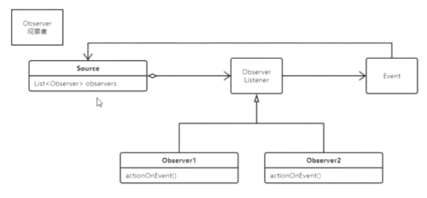
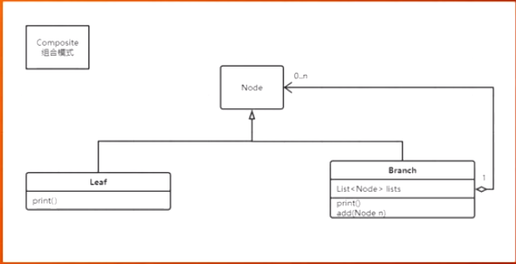
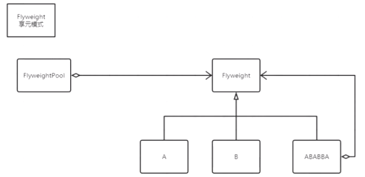

#### Observer 观察者

钩子函数、observer、listener、callback都是一个意思，都是观察者

#### Composite 组合

树状结构专用模式，比如树由分支和叶子组成；

#### flyWeight 享元模式

共享元数据，比如word，A，B,C...在文档里面每个字母都是一个对象，文档里面可以共用这些对象

比如说线程池的线程可以被重复利用

java中的String常量

