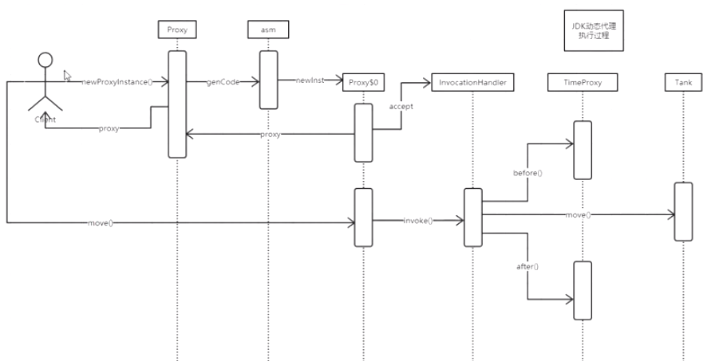

#### proxy 代理模式

在方法的前面加上处理逻辑：

继承（耦合性太高，不灵活）：通过继承的方式，在父类方法的调用前后加上处理逻辑

聚合（可以任意组合，耦合性依然很高）：可以任意组合对方法的增强

静态代理：

动态代理：

##### jdk动态代理：

jdk内部是调用了asm生成代理类，它是直接操作字节码生成的；




设置这个参数可以把jdk动态代理生成的class保存到文件中

jdk1.8:

```java
System.getProperties().put("sun.misc.ProxyGenerator.saveGeneratedFiles","true");
```

双亲委派模型：class加载机制 原因：安全性问题

#####　cglib生成代理对象：

​	cglib底层用的是asm

benchmark:性能测试

##### spring AOP：

aspect  oriented programming

