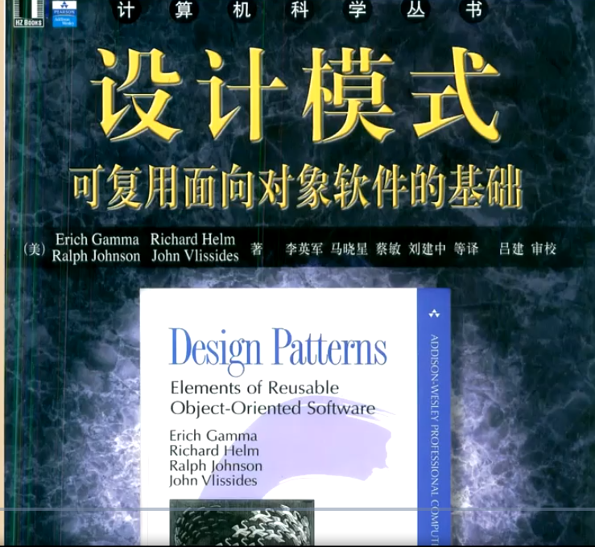
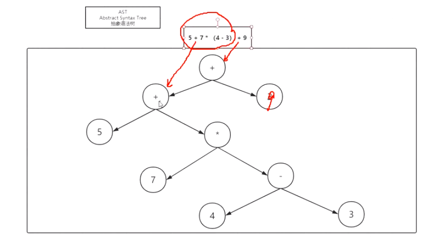
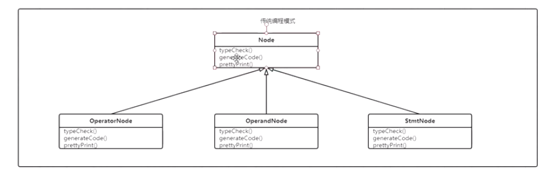
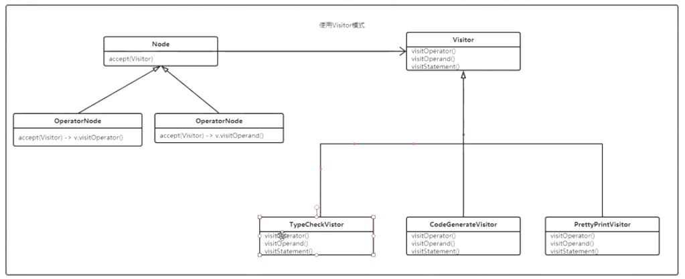

#### Iterator

用于容器和容器遍历

数据的物理结构：数组和链表两种

数据的逻辑结构：b树，stack，二叉树，queue

自定义ArrayList、LinkedList、Collection、iterator

作业：自己实现LinkedList 的Iterator方法

#### Visitor

在结构不变的情况下动态改变对于内部元素的动作，多数用在编译器的处理上

属于结构固定的类

#### 书：

#### ASM

网站：https://asm.ow2.io

书：java虚拟机规范     阿里：jvm 龙井

