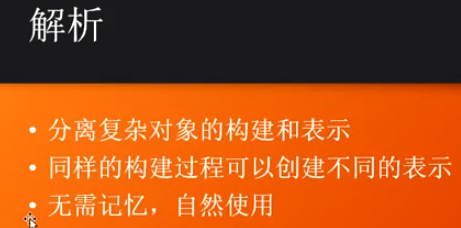
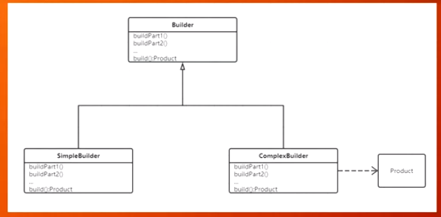
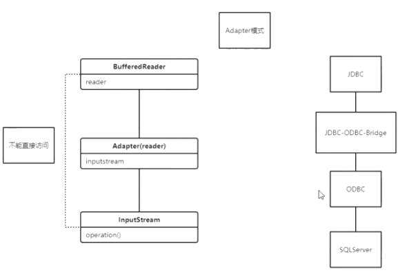
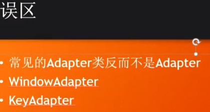
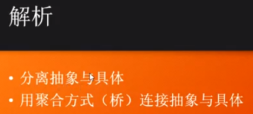
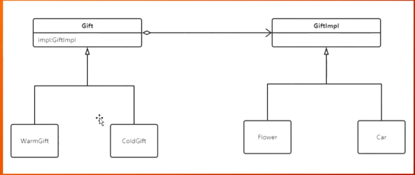
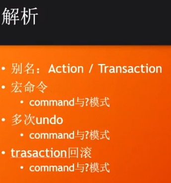

#### Builder






#### Adapter





Runtime:可以获取cpu 的核心数

```java
[Runtime 类 获取处理器核数信息]
System.out.println(rt.availableProcessors());
```

#### Bridge

使用场景比如抽象和具体两个维度会不断增长；





#### command

用来封装各种命令，doit+undo



宏命令：command与composite模式

多次undo：command与cor

trasaction回滚：command与记忆模式

#### 作业

command+cor实现多个undo