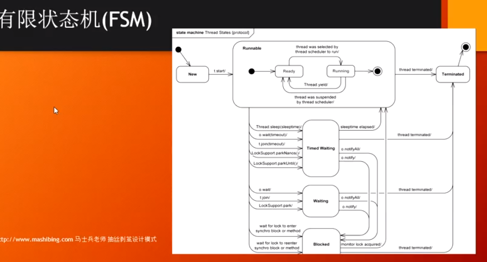

#### prototype 原型模式

Object.clone(),克隆分为深克隆和浅克隆

#### Memento 备忘录

记录状态，便于回滚,比如把坦克大战中的对象存储到磁盘，然后从磁盘读取出来

#### TemplateMethod 模板方法

比如钩子函数,比如Frame的update,paint方法会被自动调用

#### State 状态模式

根据状态来决定行为,当状态会不断扩展，每个状态下有不同的行为时，可以把状态的下几个行为抽象出来，由具体的状态类实现。

不过，不适合行为会扩展的情况，或者状态不会变化的情况；

#### Intepreter 解释器

####　类的设计原则

