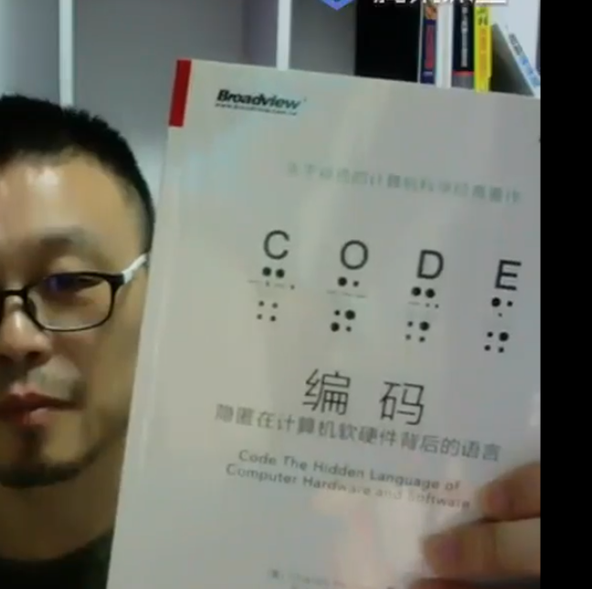

在消息中添加消息类型和解析消息的方法

加入tankMovingMsg，坦克移动的时候发送消息

加入tankStopMsg:坦克停止的时候发送消息

子弹的消息，坦克方向改变的消息，坦克死亡的消息

Tcp:Nagle算法

当发送的数据包比较小的时候，tcp会把小的数据包合成一个大的数据包发送，以提高发送效率，但是会增加延迟；

游戏一般需要禁用tcp的Nagle算法，Netty设置

其他：

人工智能：线性代数、高等数学、概率论和数理统计

leetcode:面试题

计算组成原理：《编码》

