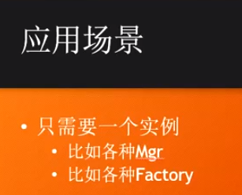
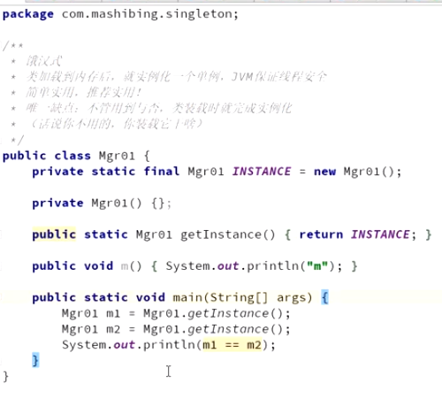
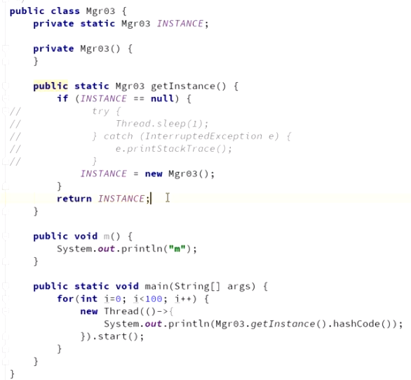
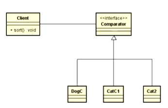

第五节开始，

设计模式

网络版

1.单例：propertyMgr、ResoureMgr

2.策略模式：Strategy

​	a. comparable

​	b. comparator

​	c.tank fire

#### 单例模式

#####　饿汉式

缺点：不管使用与否，类装载时就完成实例化

##### 饿汉式 静态语句块初始化

##### 懒汉式 线程不安全

#####　懒汉式  方法加锁

缺点：每次都需要加锁，会降低效率

##### 懒汉式 初始化加锁

有线程安全问题

##### 懒汉式双重检查锁

有线程安全问题，需要加volatile

##### 静态内部类方式

外部类加载的时候静态内部类不会被加载，只有使用到静态内部类的时候才会被加载

可以做到延迟加载，并保证线程安全

##### 枚举方式

既可以解决线程安全，又可以防止反序列化（枚举类没有构造方法，反编译可以看到它是一个抽象类）

#### Strategy 策略

comparator、comparable

