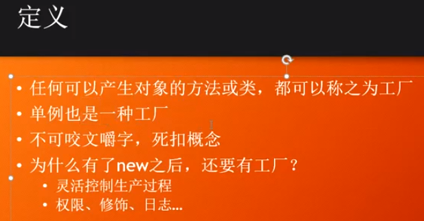
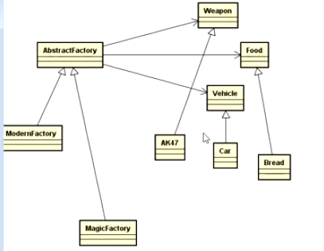
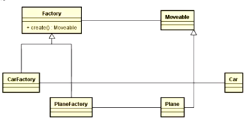

#### 策略模式

1.尽量不要为类添加某个方法需要的特定属性

fire(FireStrategy s)每次调用都需要new，因此设计成单例

使用反射创建策略对象，将class的路径配置到配置文件中

####　工厂模式

工厂的好处：可以控制产品的生产过程，比如权限控制，日志

简单工厂：

每生产一张产品要添加一个方法，需要对工厂类进行修改，可扩展性不好

工厂方法：

针对每一种产品创建一个工厂，可以生产很多类的产品，可扩展性好

抽象工厂：

生产几类产品，由具体的工厂负责生产产品

形容词用接口，名词用抽象类

#####　工厂方法　VS　抽象工厂

工厂方法：产品维度扩展，方便产品的扩展，加新产品，加工厂

抽象工厂：产品一族进行扩展  方便在产品族上扩展，比如软件换皮肤

作业：用抽象工厂完成坦克大战一键风格替换

spring bean 工厂

