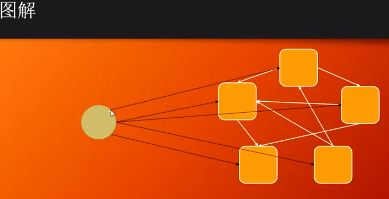

####　工厂模式

1.抽象工厂的原则：父类的属性和方法尽可能的少

spirng IOC工厂

#### 调停者　Mediator

比如消息中间件 ，例如在订单秒杀系统中，当用户提交一个订单时，可能需要做很多事情，比如减库存，记账，订单统计等等，如果由订单系统直接去做这些事会比较繁琐，把订单消息交给消息中间件，由各自的系统监听消息队列的消息来做相应的处理。

#### 门面模式 Fasade

比如去政府部门办事，需要和很多个部门打交道，如果有一个前台代替我们和其他的部门打交道，我们只需要和前台打交道，这样办事就容易多了，这就是门面模式。

#### 责任链模式
filterChain找到第一个filter->调用第一个filter->调用了filterChain->filterChain找到第二个filter->调用第二个filter
->...->直到到达filterChain的最后一个filter->...->返回到第二个filter继续执行后续部分->
返回到filterChain，然后filterChain返回到第一个filter，继续执行第一个filter后续部分->返回到
filterChain->结束

作业：

TF-解决添加新游戏物体的问题

1.TF-Facade

Frame->只做展示

GameModel->内部逻辑计算

2.GameObject