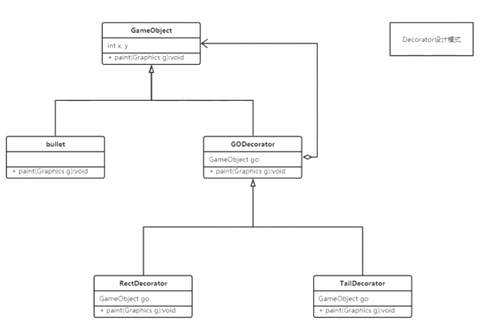
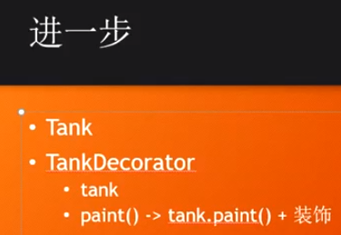

#### 责任链 chain of responsibility

Filter,Interceptor,Collider

聚合关系：什么里面有什么

设计原则：高内聚低耦合，单一职责原则

耦合度：继承>聚合>方法参数

1.代码重构：

tank的back方法：当坦克相撞则回到上一步

gameModel使用单例，其他类使用引用单例对象，不需要通过构造方法传递

在游戏对象的构造方法中把对象加入到gameModel中；

#### Decorator 装饰器

RectDecorator聚合了TailDecorator,TailDecorator聚合了Bullet;

#### Observer 设计模式

